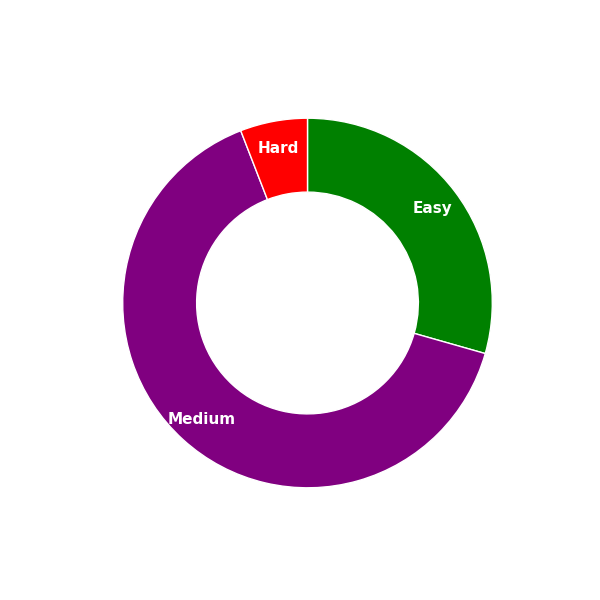

# 🧠 LeetCode Solutions


This repository contains my personal solutions to various problems on [LeetCode](https://leetcode.com/). I use this repo to track my progress and improve my problem-solving skills.

## 📂 Folder Structure

```
leetcode-solutions/
├── typescript
    ├── problem-1.ts
    ├── problem-2.ts
```

## 🚀 Languages Used

- 🟨 TypeScript

## ✅ Problem Categories

- Array
- Stack

## 📈 Progress

> 📅 **Last updated on:** July 06, 2025

| Difficulty | Solved |
| ---------- | ------ |
| Easy       | 05     |
| Medium     | 13     |
| Hard       | 01     |

# Progress Chart

> 📅 **Last updated on:** July 06, 2025



## 🛠️ How to Use

Clone this repository and explore the solutions.

```bash
git clone https://github.com/your-username/leetcode-solutions.git
cd leetcode-solutions
```

## 🌟 Credits

- Problems sourced from [LeetCode](https://leetcode.com/).
- Solutions are written and optimized by me as part of my learning journey.

## 📜 License

This repository is licensed under the MIT License.